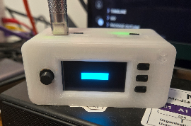

# SH1106

This package provides a driver for the sh1106 display chipset.

The driver uses eight 'pages' of 128 bytes. Each page is a row across the screen, 8 pixels high and 128 wide. As each byte is 8 bits, each byte corresponds to a column in a page, with its bits setting a pixel on or off.

This in theory allows setting individual pages rather than the whole screen - the current implementation is simplified and just expects all pages to be given when displaying.

## Example code

Simple example drawing a rectangle in the middle of the screen



```go
package main

import (
 "log"

 "github.com/chrispritchard/oled-clock/internal/sh1106"
)

func main() {
 disp, err := sh1106.NewSH1106()
 if err != nil {
  log.Fatalf("Failed to initialize SH1106: %v", err)
 }

 disp.Init()
 disp.Clear()

 var buffer [8][128]byte

 for x := 32; x < 96; x++ {
  buffer[3][x] = 0xff
  buffer[4][x] = 0xff
 }

 disp.ShowImage(buffer)

 select {}
}
```
